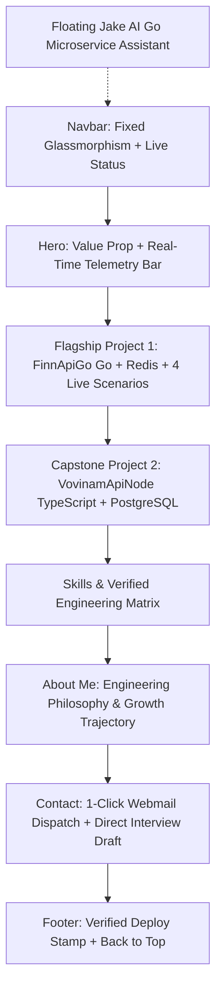

# UI/UX & Frontend Design System Audit & Master Improvement Prompt
**Target Audience:** Technical Recruiters, Engineering Managers, and Enterprise Clients  
**Candidate Profile:** Nguyen Hoang Anh Quan (Finn) — Fresher / Junior Backend Developer (Go & Node.js)  
**Evaluated Against Design Frameworks:** `design-taste-frontend`, `impeccable`, `ui-ux-pro-max`

---

## 1. Executive Summary & Design Read

> **Design Read:**  
> *"Reading this as: High-credibility Engineer Portfolio & Interactive Backend Sandbox for Technical Hiring Managers and Enterprise Clients, built with a high-trust, cyber-minimalist design language (Deep Obsidian / Pure Slate foundations, Electric Ocean Cyan primary brand accent, Emerald verification markers, and Amber defense signals), emphasizing Clean Architecture, live API telemetry, and defense-in-depth security verification."*

### Overall Assessment Scorecard: 8.5 / 10
* **Technical Credibility & Proof of Work (9.5/10):** Exceptional. Live Render API integration, 301 automated test counter, interactive 5-layer Clean Architecture inspector, and 4 runnable security scenarios (JWT rotation, token theft detection, sliding-window rate limiting, remote session management) immediately distinguish this portfolio from 99% of junior portfolios.
* **Layout Structure & Visual Rhythm (8.0/10):** Strong grid containment and responsive foundation, but needs rhythm diversification to avoid card-stack fatigue and strict adherence to the **Eyebrow Restraint Rule** (max 1 eyebrow per 3 sections).
* **Color Harmony & Theme Parity (8.5/10):** Well-chosen Slate/Obsidian + Ocean Cyan color palette with accessible contrast. Needs refactoring of hardcoded CSS `!important` overrides into clean CSS Variable tokens.
* **Recruiter UX & Interaction Flow (8.0/10):** The 2.15-second blocking preloader on every reload creates unnecessary friction for busy recruiters scanning in 6–10 seconds. Dual floating FABs (QuickNav + JakeAI) create mobile clutter.

---

## 2. Detailed Audit Findings & Design Rules Verification

### A. Layout & Information Architecture
| Checkpoint | Status | Analysis & Improvement Required |
|---|---|---|
| **Initial Viewport & Hero Discipline** | 🟢 **Compliant** | Hero uses `min-h-[92dvh]`, top padding `pt-24`, max 2-line headline, concise 20-word description, and immediate CTAs. |
| **Eyebrow Restraint** | 🔴 **Violation** | *Rule: Max 1 eyebrow badge per 3 sections.* Currently, almost every section header features an uppercase tracking pill badge (`hero.badge`, `project.finnapi.badge`, `skills.cat`, `about.title`, `contact.subtitle`). **Fix:** Retain eyebrow only on Hero and Flagship Project; let clean section titles carry the remaining sections. |
| **Section Layout Diversity** | 🟡 **Needs Refinement** | *Rule: Avoid repeating the same card container family across all sections.* Currently, Projects, Skills, and About all use standard rounded `bg-surface-900` cards with identical borders. **Fix:** Use varied layout archetypes (e.g., asymmetric bento grid for Skills, split narrative for About, and timeline/flow for Architecture). |
| **Missing Project Mount** | 🔴 **Critical Gap** | `Skills.tsx` mentions **VovinamApiNode** (Node.js, PostgreSQL 16, RBAC), and `VovinamSection.tsx` exists in the codebase, but is **not mounted in `App.tsx`**. Recruiters see the skill tag but no project proof. |

### B. Color Calibration & Light/Dark Mode Contrast
| Checkpoint | Status | Analysis & Improvement Required |
|---|---|---|
| **Base Neutrals & Accent Palette** | 🟢 **Compliant** | Dark mode uses Deep Obsidian (`#080a0f`, `#0d1117`), Light mode uses Crisp Slate (`#f8fafc`, `#ffffff`). Primary accent is Ocean Cyan (`#00E5FF` dark / `#0284c7` light). |
| **WCAG AA / AAA Text Contrast** | 🟢 **Compliant** | Primary headings achieve >12:1 contrast ratio. Body copy (`#334155` on light, `#d4d4d8` on dark) exceeds 4.5:1. |
| **Button Contrast Discipline** | 🟡 **Needs Refinement** | Primary CTA button background (`#00E5FF`) in dark mode must strictly pair with dark text (`#080a0f`) for 7:1 contrast; in light mode (`#0284c7`) it must pair with crisp white text (`#ffffff`). Remove any ambiguous `text-white dark:text-surface-950` inconsistencies. |
| **CSS Architecture & Specificity** | 🟡 **Needs Refinement** | Over 120 lines of `html:not(.dark) ... !important` exist in `index.css`. **Fix:** Migrate to pure CSS variable token bindings mapped in Tailwind configuration for maintainable, zero-hack theming. |

### C. Recruiter-Centric UX & Interaction Design
| Checkpoint | Status | Analysis & Improvement Required |
|---|---|---|
| **Preloader Friction (Bounce Rate Risk)** | 🔴 **High Priority** | The `IntroPreloader` blocks the entire screen for 2.15 seconds on every page load/refresh. Technical recruiters reviewing 50 candidates will get frustrated. **Fix:** Either show once per session via `sessionStorage`, reduce duration to 700ms, or replace with a subtle non-blocking hero boot animation. |
| **Dual Floating FAB Conflict (Mobile UX)** | 🟡 **Needs Refinement** | Having `QuickNavFab` (bottom-left) and `ChatbotAiFab` (bottom-right) simultaneously clutters mobile screens (375px–414px) and duplicates the sticky header navigation. **Fix:** Remove `QuickNavFab` (since header is already sticky) or collapse it into a single clean action hub, giving prominence to Jake AI. |
| **Contact Flow & Conversion** | 🟢 **Excellent** | Pre-filled Webmail selector (Gmail, Outlook, Yahoo, default mailto) solves the classic broken `mailto:` issue on unconfigured OS environments. One-click copy email + copy pre-filled draft works smoothly. |
| **API Failure Graceful Degradation** | 🟢 **Excellent** | Interactive security scenarios and Jake AI communicate with live Render instances, but gracefully fall back to local simulated mock telemetry when backend is cold-starting. |

---

## 3. Section-by-Section Implementation Recommendations



### 1. Preloader (`IntroPreloader.tsx`)
* **Improvement:** Wrap execution in a `sessionStorage.getItem('finn_intro_seen')` check. If already seen, bypass immediately (`return null`). If first visit, cap execution to 750ms max with smooth fade-out.

### 2. Navbar (`Navbar.tsx`)
* **Improvement:** Ensure consistent active link indicator on scroll. Enhance mobile menu drawer with smooth backdrop blur.

### 3. Hero Section (`Hero.tsx`)
* **Improvement:** Keep the high-impact telemetry bar (Online, 301 Tests, CI 7 Jobs, Latency <20ms). Ensure typography uses `leading-tight` with `tracking-tight` on the name.

### 4. Flagship Go Project (`FinnApiGoSection.tsx`)
* **Improvement:**
  * Streamline the 4 scenario cards with clear visual hierarchy: Title, Badges, One-line mechanism, and "Run Live" trigger.
  * In the modal, ensure cURL command copy button and response status badges (HTTP 200, HTTP 429, HTTP 401) are prominently visible on mobile screens.

### 5. Mount Secondary Project (`VovinamSection.tsx` in `App.tsx`)
* **Improvement:** Add `VovinamSection` into `App.tsx` directly after `FinnApiGoSection`. This proves multi-language capability (Go + TypeScript/Node.js) and relational database mastery (PostgreSQL 16 + MySQL 8).

### 6. Skills Grid (`Skills.tsx`)
* **Improvement:** Replace repetitive boxes with a modern 2x2 Clean Tech Bento Grid with subtle colored left borders (Cyan for Backend, Purple for Databases, Emerald for Security, Amber for DevOps).

### 7. Floating Controls Optimization
* **Improvement:** Retire `QuickNavFab` to eliminate UI clutter. Keep `ChatbotAiFab` (Jake AI) as the sole interactive AI floating icon on the bottom right.

---

## 4. Master Implementation Prompt (Copy-Paste Ready for Code Generation)

```markdown
### TASK: Execute Complete UI/UX Polish and Design System Optimization on Portfolio

Please apply the following design engineering enhancements to the codebase based on `design-taste-frontend`, `impeccable`, and `ui-ux-pro-max` specifications:

#### 1. Preloader Optimization (`src/components/IntroPreloader.tsx`)
- Add `sessionStorage` caching (`sessionStorage.getItem('finn_portfolio_intro_seen')`) so the preloader only displays once per browser session.
- Reduce boot timer duration from 1800ms to 750ms total for instant, snappy recruiter access.
- Ensure the ESC key and Skip button dismiss the overlay immediately.

#### 2. Layout & Project Mounting (`src/App.tsx`)
- Mount `<VovinamSection />` between `<FinnApiGoSection />` and `<Skills />` to showcase full-stack backend depth (Go + Node.js/PostgreSQL).
- Remove `<QuickNavFab />` from `App.tsx` to eliminate bottom-left mobile clutter, relying on the clean sticky `<Navbar />`.

#### 3. Eyebrow Restraint & Visual Cadence
- In `src/components/Skills.tsx`, `src/components/About.tsx`, and `src/components/Contact.tsx`:
  - Remove redundant small-caps eyebrow badges where section headings are self-explanatory.
  - Apply clean typographic hierarchy with standard sans display headings (`text-3xl sm:text-4xl font-bold tracking-tight text-zinc-100`).

#### 4. Design Tokens & CSS Cleanup (`src/index.css` & `tailwind.config.js`)
- Standardize CSS Variables for surface backgrounds and borders so light mode works seamlessly without requiring cascading `!important` rules.
- Ensure primary CTA buttons (`bg-accent-cyan`) strictly use dark high-contrast text (`text-surface-950 font-bold`) in dark mode and crisp white text in light mode.

#### 5. Verification & Responsiveness Pass
- Verify touch targets for all interactive scenario triggers and webmail buttons are >= 44x44px.
- Confirm full dark/light theme switching with zero contrast regressions.
```
